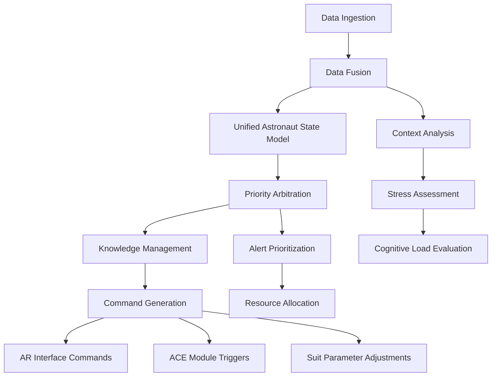
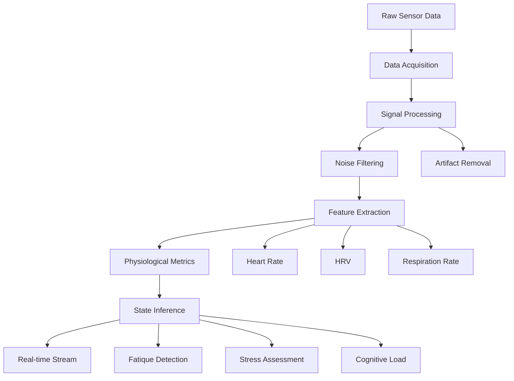
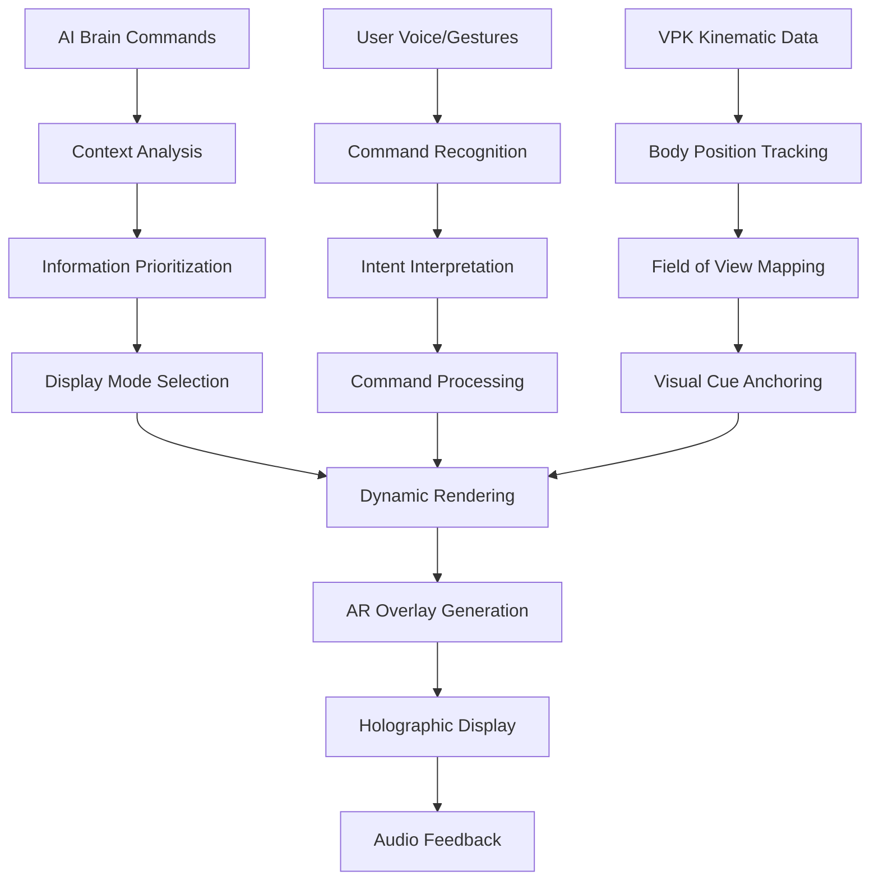
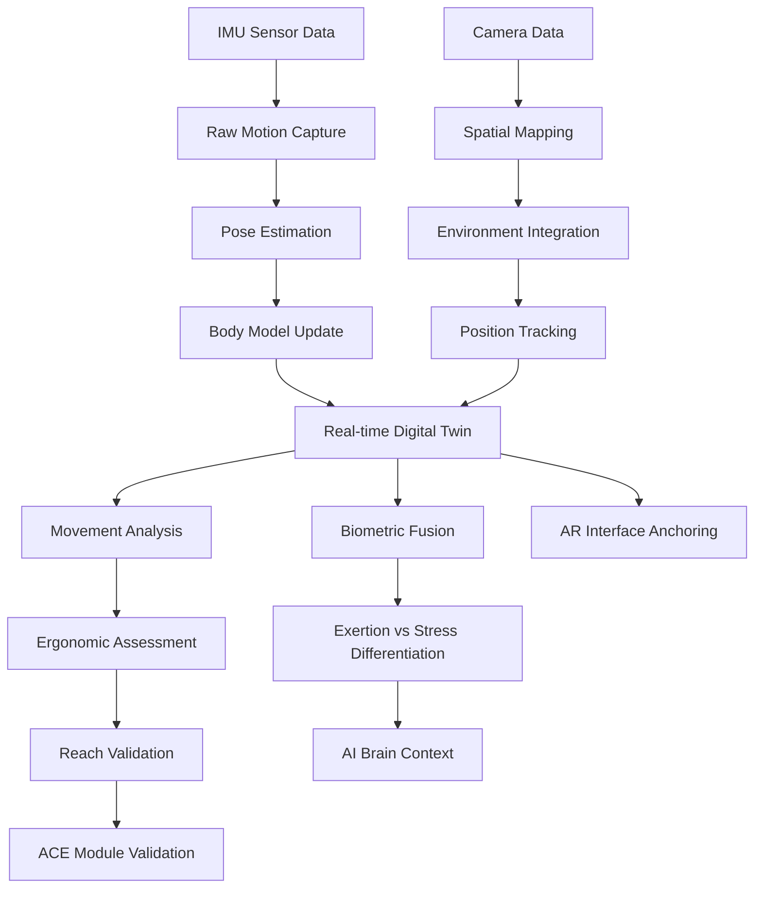
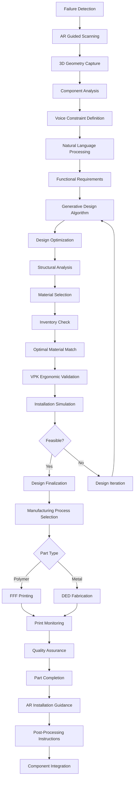
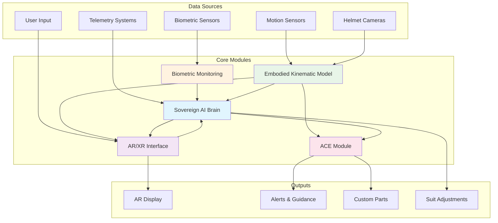

# Project AURA Module Flows and Architecture

This document provides detailed understanding and flow charts for each of the five core modules in the Project AURA ecosystem.

## 1. Sovereign AI Brain: The Central Orchestrator

The AI Brain acts as the central nervous system of the AURA ecosystem, continuously integrating data to maintain a holistic understanding of the astronaut and their environment.

### Inputs
- **Biometric Data**: Processed physiological metrics (HRV, respiration, etc.) from the Biometric Monitoring module
- **Kinematic Data**: Astronaut's body position, posture, and movement data from the VPK
- **Environmental & Suit Telemetry**: Data on suit pressure, oxygen levels, equipment status, and external hazards
- **User Input**: Voice commands, gestures, and task selections from the astronaut via the AR Interface

### Processing Flow

### Key Processing Steps
1. **Data Fusion**: Combines all incoming data streams into a unified model
2. **Priority Arbitration**: Analyzes competing demands and prioritizes based on urgency and astronaut state
3. **Knowledge Management**: Updates and queries local knowledge graph
4. **Command Generation**: Sends contextual commands to other modules

### Outputs
- Commands to AR Interface for display adjustments
- Triggers to ACE Module for hardware solutions
- Suit parameter adjustments based on biometric feedback

## 2. Closed-Loop Biometric Monitoring: The Physiological Sensor

This module focuses on capturing and delivering a clean, continuous stream of the astronaut's physiological state.

### Input
- Raw data from non-invasive sensors: ECG, skin temperature, respiration sensors

### Processing Flow

### Key Processing Steps
1. **Data Acquisition**: Continuous collection of raw physiological signals
2. **Signal Processing**: Cleaning and filtering of raw data
3. **Feature Extraction**: Derivation of meaningful metrics (HR, HRV, respiration)
4. **State Inference**: Analysis of physiological state indicators

### Output
- Processed biometric data stream to Sovereign AI Brain
- Real-time physiological state assessment

## 3. Adaptive AR/XR Visual Interface: The Human-Machine Interface

This module is the astronaut's window into the AURA system, presenting information dynamically and intuitively.

### Inputs
- Display commands from AI Brain
- Kinematic data from VPK for anchoring
- User commands (voice and gestures)

### Processing Flow

### Key Processing Steps
1. **Command Recognition**: Processing voice and gesture inputs
2. **Dynamic Rendering**: Adjusting display based on context and state
3. **Body-Centric Anchoring**: Positioning visual cues relative to user's body
4. **Auto-Dashboarding**: Adapting information density based on stress/cognitive load

### Output
- Visual and audio output to astronaut
- Feedback loop with AI Brain and VPK

## 4. Embodied Kinematic Model (VPK): The Digital Twin

The VPK creates and maintains a real-time digital twin of the astronaut's body.

### Input
- Raw sensor data from suit IMUs
- Spatial mapping data from helmet cameras

### Processing Flow

### Key Processing Steps
1. **Pose Estimation**: Calculating body posture from sensor data
2. **Environmental Mapping**: Tracking position in physical space
3. **Data Fusion**: Combining movement with biometric data
4. **Ergonomic Validation**: Assessing physical feasibility

### Outputs
- Body-centric guidance data to AR Interface
- Ergonomic validation to ACE Module
- Movement context to AI Brain

## 5. Adaptive Contingency Engineering (ACE): The On-Demand Fabricator

This module solves hardware failures by manufacturing new parts on-demand.

### Trigger
- AI Brain detects critical hardware failure
- Astronaut manual report

### Processing Flow

### Key Processing Steps
1. **Guided Scanning**: AR-assisted 3D capture of broken component
2. **Voice-Defined Constraints**: Natural language specification of requirements
3. **AI-Powered Generative Design**: Algorithmic creation of optimized designs
4. **Material Selection**: Choosing appropriate space-qualified materials
5. **VPK-Driven Validation**: Ergonomic assessment of design feasibility
6. **Autonomous Manufacturing**: Microgravity-adapted 3D printing
7. **Guided Installation**: AR step-by-step assembly instructions

### Outputs
- Custom-manufactured replacement parts
- Installation guidance and validation
- Updated component inventory

## Integration Flow

This comprehensive flow documentation provides the foundation for implementing and understanding the interconnected nature of Project AURA's modules.
